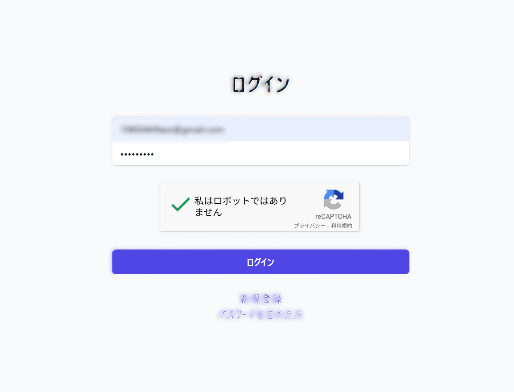

# 🔐 セキュア認証システム

[](https://nextjs.org/)
[](https://www.typescriptlang.org/)
[](https://www.prisma.io/)
[](https://tailwindcss.com/)

## 📋 概要

このプロジェクトは、**セキュアな設計**を重視した認証専用システムです。現代のWebアプリケーションに必要なセキュリティ機能を実装し、実際のプロダクション環境でも使用できるレベルのセキュリティ対策を目標に作成してます。

### 🎯 プロジェクトの特徴

- **🛡️ 多層防御**: CSP、XSS対策、CSRF対策を含む包括的なセキュリティ
- **🔒 暗号化**: bcryptによるパスワードハッシュ化（ソルトラウンド10）
- **🤖 ボット対策**: reCAPRCHAによるボット対策
- **🍪 セキュアなセッション管理**: JWTとHTTPOnly Cookieの組み合わせ
- **📧 リアルタイム通知**: ログイン時の自動メール通知
- **🔑 パスワードリセット**: 秘密の質問による安全なパスワード復旧

## 🚀 技術スタック

### フロントエンド
- **Next.js 15.3.3** - React フレームワーク（App Router使用）
- **TypeScript** - 型安全性の確保
- **TailwindCSS** - レスポンシブデザイン

### バックエンド
- **Next.js API Routes** - サーバーサイドAPI
- **Prisma ORM** - データベース操作
- **SQLite** - 軽量データベース（本番ではPostgreSQL推奨）

### セキュリティ
- **bcrypt** - パスワードハッシュ化
- **jose** - JWT操作
- **zod** - バリデーション

### 開発・運用
- **ESLint** - コード品質管理
- **TypeScript** - 型チェック

## 🔒 セキュリティ機能

### 1. Google reCAPTCHA v2 🤖

```typescript
// ログイン時のreCAPTCHA検証
async function verifyRecaptcha(token: string): Promise<boolean> {
  const response = await fetch('https://www.google.com/recaptcha/api/siteverify', {
    method: 'POST',
    headers: { 'Content-Type': 'application/x-www-form-urlencoded' },
    body: `secret=${process.env.RECAPTCHA_SECRET_KEY}&response=${token}`,
  });
  const data = await response.json();
  return data.success === true;
}
```

- **「私はロボットではありません」チェックボックス**: ユーザーフレンドリーな認証
- **サーバーサイド検証**: フロントエンドとバックエンドの双方で認証
- **CSP対応**: reCAPTCHAドメインを許可したセキュリティポリシー

### 2. パスワードセキュリティ 🔐

```typescript
// bcryptによるパスワードハッシュ化（ソルトラウンド10）
const hashedPassword = await bcrypt.hash(password, 10);
```

- **パスワードハッシュ化**: bcryptライブラリでソルトラウンド10
- **パスワード強度**: 最低6文字以上の制限
- **秘密の質問**: パスワードリセット用の追加認証

### 3. セッション管理 🍪

```typescript
// JWTとHTTPOnly Cookieによるセキュアなセッション
const sessionToken = await new SignJWT({ userId, email })
  .setProtectedHeader({ alg: 'HS256' })
  .setExpirationTime(expiresAt)
  .sign(secret);
```

- **HTTPOnly Cookie**: XSS攻撃からの保護
- **セッション有効期限**: 7日間の自動失効
- **データベース管理**: セッションテーブルでの一元管理

### 4. セキュリティヘッダー 🛡️

```typescript
// CSP（reCAPTCHA対応）
const cspHeader = `
  default-src 'self';
  script-src 'self' 'unsafe-eval' 'unsafe-inline' 
             https://www.google.com/recaptcha/ 
             https://www.gstatic.com/recaptcha/;
  connect-src 'self' https://www.google.com/recaptcha/;
  frame-src https://www.google.com/recaptcha/;
`;
```

- **CSP（Content Security Policy）**: XSS攻撃防止（reCAPTCHA対応済み）
- **X-Frame-Options**: クリックジャッキング対策
- **X-Content-Type-Options**: MIME型スニッフィング防止


## 🌟 主要機能

### 1. ユーザー登録 📝


- **メールアドレス**: 重複チェック付き
- **パスワード**: 確認入力で入力ミス防止
- **秘密の質問**: 5種類から選択可能
- **バリデーション**: リアルタイム入力検証

### 2. セキュアログイン 🔑



- **認証処理**: bcryptによるパスワード照合
- **セッション作成**: JWT + HTTPOnly Cookie
- **ログイン通知**: 自動メール送信
- **エラーハンドリング**: セキュリティに配慮したエラーメッセージ
- **bot防止機能**:　botからの不正なアクセス攻撃への対策

### 3. パスワードリセット 🔄


**2段階認証プロセス**:
1. **メールアドレス確認**: 登録済みユーザーの検証
2. **秘密の質問**: 本人確認のセカンドファクター

## 🎨 ユーザーインターフェース

### ダッシュボード 📊


- **ユーザー情報表示**: セッション情報の表示
- **セキュリティ機能一覧**: 実装機能の説明
- **ログアウト機能**: セッション安全削除

## 📧 メール通知システム

### ログイン通知メール

```typescript
// 自動ログイン通知
export async function sendLoginNotification(email: string): Promise<void> {
  const mailOptions = {
    from: process.env.SMTP_USER,
    to: email,
    subject: 'ログイン通知',
    html: `
      <h2>ログイン通知</h2>
      <p>お客様のアカウントにログインが検出されました。</p>
      <p><strong>ログイン時刻:</strong> ${new Date().toLocaleString('ja-JP')}</p>
      <p>心当たりがない場合は、速やかにパスワードを変更してください。</p>
    `,
  };
  await transporter.sendMail(mailOptions);
}
```

- **Gmail SMTP**: セキュアなメール送信
- **HTML形式**: 視認性の高いメール

## 🗃️ データベース設計

### ERD（Entity Relationship Diagram）

```sql
-- Users テーブル
CREATE TABLE users (
    id TEXT PRIMARY KEY,
    email TEXT UNIQUE NOT NULL,
    password TEXT NOT NULL,
    secretQuestion TEXT NOT NULL,
    secretAnswer TEXT NOT NULL,
    createdAt DATETIME DEFAULT CURRENT_TIMESTAMP,
    updatedAt DATETIME DEFAULT CURRENT_TIMESTAMP
);

-- Sessions テーブル
CREATE TABLE sessions (
    id TEXT PRIMARY KEY,
    userId TEXT NOT NULL,
    expiresAt DATETIME NOT NULL,
    createdAt DATETIME DEFAULT CURRENT_TIMESTAMP,
    FOREIGN KEY (userId) REFERENCES users(id) ON DELETE CASCADE
);
```

### データベース特徴
- **正規化**: 第3正規形まで正規化
- **外部キー制約**: データ整合性の保証
- **カスケード削除**: ユーザー削除時のセッション自動削除
- **インデックス**: email列にユニークインデックス

## 🛠️ セットアップ手順

### 1. 環境構築
`.env`ファイルを作成し、以下の変数を設定

```env
# データベース（SQLite使用）
DATABASE_URL="file:./app.db"

# セッション秘密鍵
SESSION_SECRET="your-very-secure-session-secret-key-change-this-to-something-random"

# メール送信設定（Gmail SMTP例）
SMTP_HOST="smtp.gmail.com"
SMTP_PORT="587"
SMTP_USER="your-email@gmail.com"
SMTP_PASS="your-app-password"

# Google reCAPTCHA v2（重要：実際のキーに置き換える）
NEXT_PUBLIC_RECAPTCHA_SITE_KEY="your-recaptcha-site-key"
RECAPTCHA_SECRET_KEY="your-recaptcha-secret-key"

# 環境設定
NODE_ENV="development"
```

### 2. Google reCAPTCHA v2の設定

1. [Google reCAPTCHA](https://www.google.com/recaptcha/)にアクセス
2. 「Admin Console」から新しいサイトを登録
3. **reCAPTCHA v2**を選択し、**「私はロボットではありません」チェックボックス**を選択
4. ドメイン設定:
   - 開発環境: `localhost`
   - 本番環境: 実際のドメイン名
5. サイトキーとシークレットキーを`.env`に設定


### 3. データベース初期化

```bash
# Prismaクライアント生成
npx prisma generate

# データベース作成
npx prisma db push

# 初期データ投入
npx prisma db seed
```

### 4. 開発サーバー起動

```bash
npm run dev
```

## 🧪 テストアカウント

開発用テストアカウント:
- **メールアドレス**: `test@example.com`
- **パスワード**: `testpass123`
- **秘密の質問**: 「あなたの好きな色は？」
- **答え**: `青`

## 📁 プロジェクト構造

```
src/
├── app/
│   ├── api/                    # API Routes
│   │   ├── login/             # ログインAPI（reCAPTCHA検証含む）
│   │   ├── logout/            # ログアウトAPI
│   │   ├── signup/            # ユーザー登録API
│   │   ├── reset-password/    # パスワードリセットAPI
│   │   └── session/           # セッション確認API
│   ├── dashboard/             # ダッシュボードページ
│   ├── login/                # ログインページ（reCAPTCHA統合済み）
│   ├── signup/               # ユーザー登録ページ
│   ├── reset-password/       # パスワードリセットページ
│   ├── layout.tsx           # レイアウト（reCAPTCHAスクリプト読み込み）
│   └── page.tsx             # ホームページ
├── lib/                      # ユーティリティライブラリ
│   ├── auth.ts              # 認証関連の関数
│   └── mail.ts              # メール送信機能
└── middleware.ts            # ミドルウェア（CSP設定とreCAPTCHA対応）
```
## 🔒 実装済みセキュリティ機能

- ✅ **Google reCAPTCHA v2**: ログイン時のボット攻撃対策
- ✅ **パスワードハッシュ化**: bcryptによる安全なパスワード保存
- ✅ **セッション管理**: JWT + データベーストークン管理
- ✅ **CSP**: XSS攻撃防止（reCAPTCHA対応済み）
- ✅ **セキュリティヘッダー**: 各種Web攻撃対策
- ✅ **入力値検証**: Zodによる型安全なバリデーション
- ✅ **秘密の質問**: パスワードリセット時の本人確認
- ✅ **ログイン通知**: 不正アクセス検知のためのメール通知
  
## 🐛 トラブルシューティング

### よくある問題と解決方法

1. **メール送信エラー**
   ```bash
   # Gmailアプリパスワードの設定を確認
   # 2段階認証を有効化してからアプリパスワードを生成
   # アプリパスワードはスペースを入れずに入力
   ```

2. **データベース接続エラー**
   ```bash
   # Prismaクライアントの再生成
   npx prisma generate
   npx prisma db push
   ```

3. **セッションエラー**
   ```bash
   # セッションシークレットの設定を確認
   # 32文字以上の安全な文字列を使用
   ```

## 🤝 コントリビューション

1. このリポジトリをフォーク
2. 機能ブランチを作成 (`git checkout -b feature/amazing-feature`)
3. 変更をコミット (`git commit -m 'Add amazing feature'`)
4. ブランチにプッシュ (`git push origin feature/amazing-feature`)
5. プルリクエストを作成


## 👨‍💻 プロフィール
- GitHub: [@s-ao213](https://github.com/s-ao213)
- Email: ri22077b@st.omu.ac.jp
- Portfolio: https://s-ao213.github.io/portfolio

